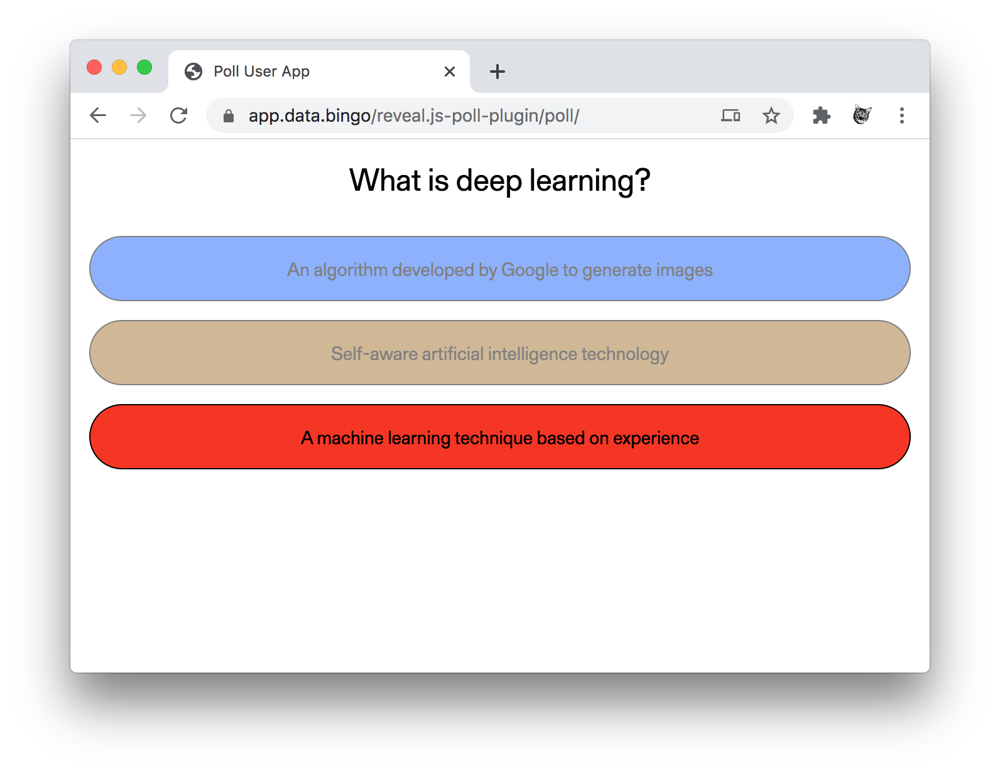
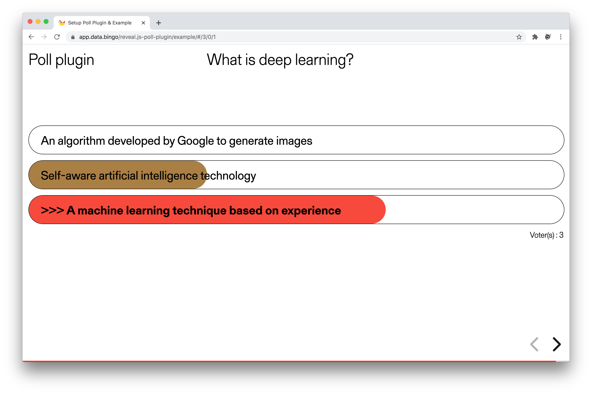

<h1 style="font-size: 3em;">Poll plugin, Reveal.js</h1>

Poll is a plugin for integrating polls and quizzes into reveal.js presentations. This plugin allows you to collect the impressions of your participants in your conferences or to test their knowledge. This plugin does not collect any personal data

## General Information

The poll plugin consists of three parts:

1. reveal.js plugin to show a poll and the result within the slides
1. mobile website for end users to participate in the poll
1. API server and SQLite database to manage the poll data 

When a slide is shown that has a poll, the audience can open the mobile website and vote. When the presenter clicks on one of the answers, the poll is finished and the result is shown on the slides as a bar chart. All the time, when there is at least one response, the number of participations is shown on the top right corner of the poll.





## Demo

Poll plugin in Reveal.js presentation
https://app.data.bingo/reveal.js-poll-plugin/example/

Poll User App
https://app.data.bingo/reveal.js-poll-plugin/poll/

## Files

- poll/index.html Mobile web site for end users to participate in the poll
- poll/app.js Javascript logic for the mobile web site
- poll/poll.css Stylesheet for reveal.js
- poll/poll.js reveal.js Plugin
- poll/api/index.php PHP script that handles API requests (start/stop poll, respond, ...)
- poll/api/poll.db SQLite database that stores the questions, answers and responses

## Installation and Usage

### Server

The web server that hosts the API and the database requires PHP and php-sqlite3. The same server can be used to host the mobile website.

1. Move the content of the `poll` folder to the root directory of the server, let's call it http://example.com for now
1. Make the folder `api` and the database file `api/poll.db` writable (777)
1. Test the API with http://example.com/api, it should show "No method"
1. Test the mobile website with http://example.com, it should show "currently no poll running"
1. Test the API again: http://example.com/api/?method=start_poll&data={"question":"Test","answers":["X","Y","Z"],"correct_answers":["B"]}, it should show `{"OK":true}`
1. Test the mobile website again: http://example.com, It should show the question "Test" and three answers.

### Presentation Client

The presentation client needs a PHP-enabled web server to forward API requests to the server via the script proxy.php. It's also possible that the presentation client is the same machine as the web server.

1. Move the content of the `poll` folder to the reveal.js presentation directory
1. Update the fetch path in poll.js to your api path
1. Include the CSS in your slides: `<link rel="stylesheet" href="poll/poll.css" />`
1. Initialize reveal.js with the following dependency: `{ src: 'poll/poll.js', async: true }`
1. Add polls to your slides:

```
<div class="container poll fragment" data-poll-question="Question?">
  <ul class="responses">
    <li>Wrong answer</li>
    <li data-poll="correct">Correct answer</li>
  </ul>
  <div class="fragment result"></div>
</div>
```

Use the `style="bottom:..., right:..."` to move the poll to the correct position. 

## License
MIT licensed

Copyright (c) 2021 Bastien Didier, https://data.bingo
Copyright (c) 2020 Johannes Schildgen